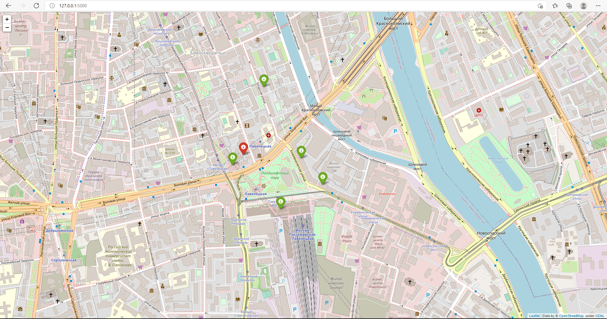

# Cafe search

The application asks for your location, then starts a server where you will see the 5 cafes in Moscow closest to you. Developed using the `Flask`, `folium`, `requests`, `python-dotenv`, `geopy` library, [open cafe location data](https://data.mos.ru/opendata/7710881420-obshchestvennoe-pitanie-v-moskve) and [API key](https://passport.yandex.ru/auth?origin=apikeys&retpath=https%3A%2F%2Fdeveloper.tech.yandex.ru%2F).

# How to start

Clone the repository with ssh:
```bash
git clone git@github.com:MaxHC-vlop/cafe_search.git
```

Create a virtual environment on directory project:
```bash
python3.10 -m venv env
```

Start the virtual environment:
```bash
. env/bin/activate
```

Then use pip (or pip3, if there is a conflict with Python2) to install dependencies:
```bash
pip install -r requirements.txt
```
Create an `.env` file in your project directory and create 2 variables in that file:

```
API_KEY='your_api_key'
```

## Run

```bash
python3 main.py
# you will see
Введите местоположение: метро Павелецкая
 * Serving Flask app 'main' (lazy loading)
 * Environment: production
   WARNING: This is a development server. Do not use it in a production deployment.
   Use a production WSGI server instead.
 * Debug mode: off
 * Running on all addresses (0.0.0.0)
   WARNING: This is a development server. Do not use it in a production deployment.
 * Running on http://127.0.0.1:5000
 * Running on http://10.110.79.39:5000 (Press CTRL+C to quit)
```

Follow the link provided `http://10.110.79.39:5000` :

